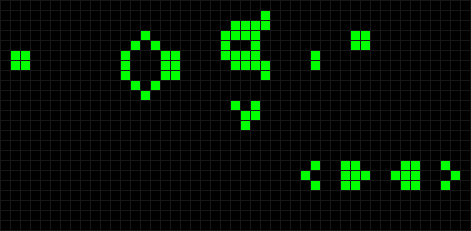

# 🎮 Game of Life — Реализация на C++ (SFML)



> Реализация клеточного автомата **"Игра Жизни"** Джона Конвея с графическим интерфейсом на языке **C++** с использованием библиотеки **SFML**.

---

## 🔍 Особенности проекта

- Симуляция поколений клеток по правилам Конвея  
- Графическое главное меню с настройками  
- Регулировка скорости симуляции  
- Возможность добавления/удаления клеток мышью  

---

## ⚙️ Требования

Для сборки и запуска проекта необходимы:

| Компонент     | Версия / Требование         |
|---------------|-----------------------------|
| Язык          | C++17                       |
| Система сборки| CMake ≥ 3.12                |
| Библиотека    | SFML 2.5.1                  |

---

## 🛠 Сборка проекта

### 1. Клонирование репозитория:
```bash
git clone https://github.com/BorodinaAlisa/PROJECT.git 
cd PROJECT
```
### 2. Создание папки сборки и сборка проекта:
```bash
mkdir build && cd build
cmake ..
make
```
### 3. Запуск игры:
```bash
./GameOfLife
```
### 🕹️ Управление

```bash
| Действие                     | Клавиша / Кнопка     |
|-----------------------------|----------------------|
| Добавить клетку             | Левая кнопка мыши    |
| Удалить клетку              | Правая кнопка мыши   |
| Пауза / Продолжить          | Пробел               |
| Переключить режим           | T                    |
| Изменить скорость           | W / S                |
| Сбросить поле               | R                    |
| Вернуться в главное меню    | M                    |
| Выйти из игры               | Q                    |
```

### Структура проекта
``` bash
PROJECT/
│
├── include/
│   ├── GameOfLifeCore.hpp        
│   └── GameOfLifeRenderer.hpp   
│
├── resources/                    
│   ├── exit2.png
│   ├── fon2.png
│   ├── game2.png
│   ├── gun_pentadec.gif
│   ├── OpenSans-Regular.ttf
│   ├── play2.png
│   └── rules2.png
│
├── src/
│   ├── GameOfLifeCore.cpp       
│   ├── GameOfLifeRenderer.cpp    
│   └── main.cpp                  
│
├── tests/
│   └── GameOfLifeCoreTest.cpp    
│
├── README.md                     
└── CMakeLists.txt                
```

### 📄 Лицензия

Этот проект распространяется под лицензией MIT.
Вы можете свободно использовать, изменять и распространять его при условии сохранения уведомления об авторстве
